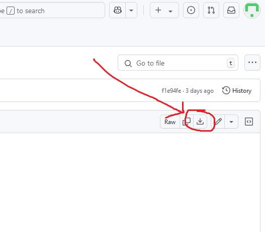

# R Workshop with Tess and Siobhan 

These are the files and scripts needed to participate in the R Workshop scheduled for 14.02.2025.   

The workshop consists of five sections in the following order:  
  * Basic data manipulation (tutorial at [Basic_data_manipulation/data_intro.html](https://github.com/tessbrewer/R_Workshop/blob/main/Basic_data_manipulation/data_intro.html))
  * Basic graphing (tutorial at [Basic_graphing/Basic_graphing_with_ggplot2.html](https://github.com/tessbrewer/R_Workshop/blob/main/Basic_graphing/Basic_graphing_with_ggplot2.html))
  * Growth curves (tutorial at [Growth_curves/scripts/growth_curver.html](https://github.com/tessbrewer/R_Workshop/blob/main/Growth_curves/scripts/growth_curver.html))
  * Expression data visualization (tutorial at [Expression_data/expression_data.html](https://github.com/tessbrewer/R_Workshop/blob/main/Expression_data/expression_data.html))
  * General ggplot2 tips and tricks (tutorial at [Basic_graphing/making_graphs_prettier.html](https://github.com/tessbrewer/R_Workshop/blob/main/Basic_graphing/making_graphs_prettier.html))

To look at any of these tutorials, click the link above and download it by clicking this button on the top right of the page:

 

then double-click on the downloaded file.

**You don't need to know any R to participate.** See you soon!
